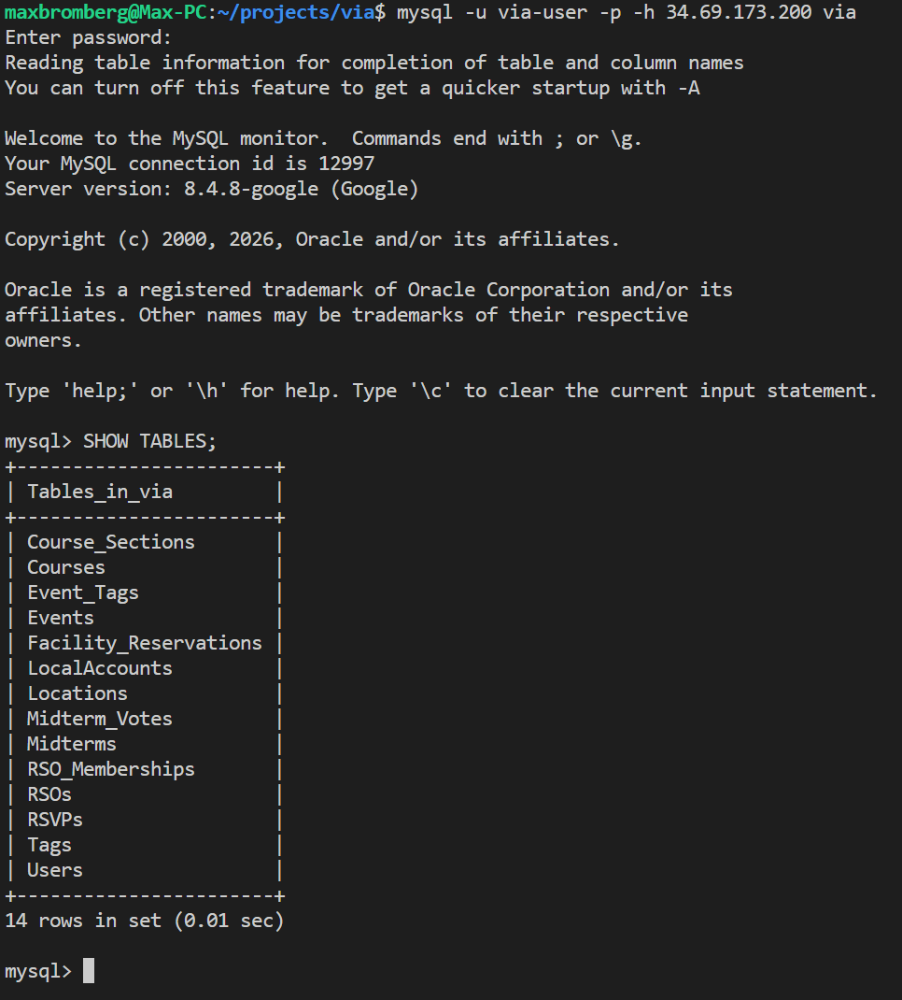
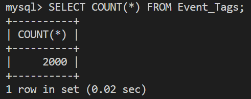
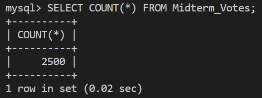
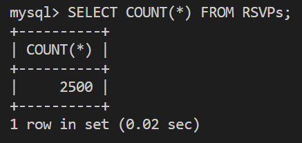
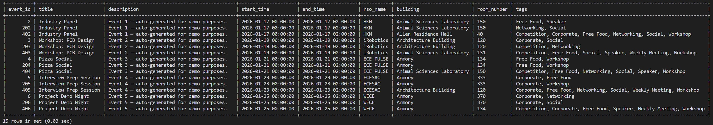
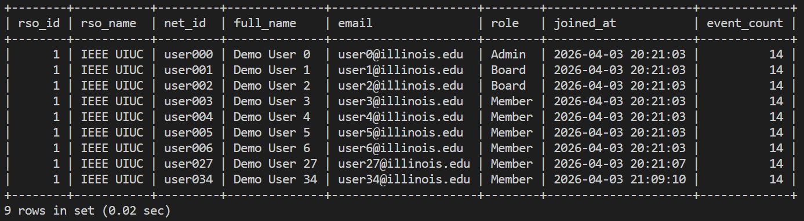
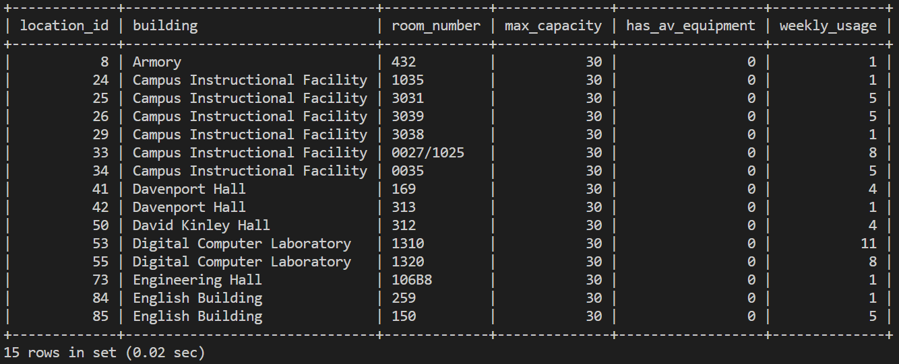

# CS 411 Stage 3: Database Implementation
**Project:** Virtually Integrated Agenda (VIA)
**Team:** Team001-TableForFour

---

## Part 1: Database Implementation

### 1.1 Database Connection


### 1.2 DDL Commands

The following DDL was used to create the database. Full source: `server/db/schema.sql`.

```sql
CREATE DATABASE IF NOT EXISTS via;
USE via;

CREATE TABLE Users (
  net_id       VARCHAR(20)  NOT NULL,
  full_name    VARCHAR(100) NOT NULL,
  email        VARCHAR(100) NOT NULL,
  is_global_admin BOOLEAN  NOT NULL DEFAULT FALSE,
  PRIMARY KEY (net_id),
  UNIQUE KEY uq_email (email)
);

CREATE TABLE LocalAccounts (
  net_id        VARCHAR(20)  NOT NULL,
  password_hash VARCHAR(255) NOT NULL,
  PRIMARY KEY (net_id),
  FOREIGN KEY (net_id) REFERENCES Users(net_id) ON DELETE CASCADE
);

CREATE TABLE RSOs (
  rso_id       INT          NOT NULL AUTO_INCREMENT,
  name         VARCHAR(100) NOT NULL,
  description  TEXT,
  logo_color   VARCHAR(7)   NOT NULL DEFAULT '#000000',
  founded_year INT,
  PRIMARY KEY (rso_id)
);

CREATE TABLE RSO_Memberships (
  net_id    VARCHAR(20) NOT NULL,
  rso_id    INT         NOT NULL,
  role      VARCHAR(20) NOT NULL DEFAULT 'Member',
  joined_at DATETIME    NOT NULL DEFAULT CURRENT_TIMESTAMP,
  PRIMARY KEY (net_id, rso_id),
  FOREIGN KEY (net_id)  REFERENCES Users(net_id) ON DELETE CASCADE,
  FOREIGN KEY (rso_id)  REFERENCES RSOs(rso_id)  ON DELETE CASCADE,
  CONSTRAINT chk_membership_role CHECK (role IN ('Member', 'Board', 'Admin'))
);

CREATE TABLE Locations (
  location_id     INT          NOT NULL AUTO_INCREMENT,
  building        VARCHAR(50)  NOT NULL,
  room_number     VARCHAR(20)  NOT NULL,
  max_capacity    INT          NOT NULL,
  has_av_equipment BOOLEAN     NOT NULL DEFAULT FALSE,
  PRIMARY KEY (location_id),
  UNIQUE KEY uq_room (building, room_number)
);

CREATE TABLE Courses (
  course_code VARCHAR(20)  NOT NULL,
  title       VARCHAR(200) NOT NULL,
  PRIMARY KEY (course_code)
);

CREATE TABLE Course_Sections (
  section_id   INT         NOT NULL AUTO_INCREMENT,
  course_code  VARCHAR(20) NOT NULL,
  location_id  INT         NOT NULL,
  day_of_week  VARCHAR(20) NOT NULL,
  start_time   TIME        NOT NULL,
  end_time     TIME        NOT NULL,
  semester     VARCHAR(20) NOT NULL,
  PRIMARY KEY (section_id),
  FOREIGN KEY (course_code) REFERENCES Courses(course_code)   ON DELETE CASCADE,
  FOREIGN KEY (location_id) REFERENCES Locations(location_id) ON DELETE CASCADE
);

CREATE TABLE Events (
  event_id    INT          NOT NULL AUTO_INCREMENT,
  rso_id      INT          NOT NULL,
  created_by  VARCHAR(20)  NOT NULL,
  location_id INT          NOT NULL,
  title       VARCHAR(200) NOT NULL,
  description TEXT,
  start_time  DATETIME     NOT NULL,
  end_time    DATETIME     NOT NULL,
  is_private  BOOLEAN      NOT NULL DEFAULT FALSE,
  PRIMARY KEY (event_id),
  FOREIGN KEY (rso_id)      REFERENCES RSOs(rso_id)           ON DELETE CASCADE,
  FOREIGN KEY (created_by)  REFERENCES Users(net_id)          ON DELETE CASCADE,
  FOREIGN KEY (location_id) REFERENCES Locations(location_id) ON DELETE CASCADE,
  CONSTRAINT chk_event_times CHECK (end_time > start_time)
);

CREATE TABLE Tags (
  tag_name VARCHAR(50) NOT NULL,
  PRIMARY KEY (tag_name)
);

CREATE TABLE Event_Tags (
  event_id INT         NOT NULL,
  tag_name VARCHAR(50) NOT NULL,
  PRIMARY KEY (event_id, tag_name),
  FOREIGN KEY (event_id) REFERENCES Events(event_id) ON DELETE CASCADE,
  FOREIGN KEY (tag_name) REFERENCES Tags(tag_name)   ON DELETE CASCADE
);

CREATE TABLE RSVPs (
  net_id   VARCHAR(20) NOT NULL,
  event_id INT         NOT NULL,
  status   VARCHAR(20) NOT NULL DEFAULT 'Going',
  PRIMARY KEY (net_id, event_id),
  FOREIGN KEY (net_id)   REFERENCES Users(net_id)   ON DELETE CASCADE,
  FOREIGN KEY (event_id) REFERENCES Events(event_id) ON DELETE CASCADE,
  CONSTRAINT chk_rsvp_status CHECK (status IN ('Going', 'Maybe', 'Not Going'))
);

CREATE TABLE Midterms (
  midterm_id  INT         NOT NULL AUTO_INCREMENT,
  course_code VARCHAR(20) NOT NULL,
  submitted_by VARCHAR(20) NOT NULL,
  location_id INT         NOT NULL,
  title       VARCHAR(200) NOT NULL,
  start_time  DATETIME    NOT NULL,
  end_time    DATETIME    NOT NULL,
  status      VARCHAR(20) NOT NULL DEFAULT 'Pending',
  PRIMARY KEY (midterm_id),
  FOREIGN KEY (course_code)  REFERENCES Courses(course_code)   ON DELETE CASCADE,
  FOREIGN KEY (submitted_by) REFERENCES Users(net_id)          ON DELETE CASCADE,
  FOREIGN KEY (location_id)  REFERENCES Locations(location_id) ON DELETE CASCADE,
  CONSTRAINT chk_midterm_times  CHECK (end_time > start_time),
  CONSTRAINT chk_midterm_status CHECK (status IN ('Pending', 'Confirmed', 'Cancelled'))
);

CREATE TABLE Midterm_Votes (
  midterm_id INT         NOT NULL,
  net_id     VARCHAR(20) NOT NULL,
  vote_value INT         NOT NULL,
  PRIMARY KEY (midterm_id, net_id),
  FOREIGN KEY (midterm_id) REFERENCES Midterms(midterm_id) ON DELETE CASCADE,
  FOREIGN KEY (net_id)     REFERENCES Users(net_id)        ON DELETE CASCADE,
  CONSTRAINT chk_vote_value CHECK (vote_value IN (-1, 1))
);

CREATE TABLE Facility_Reservations (
  reservation_id INT          NOT NULL AUTO_INCREMENT,
  location_id    INT          NOT NULL,
  customer       VARCHAR(255) NOT NULL DEFAULT '',
  event_name     VARCHAR(500) NOT NULL DEFAULT '',
  start_time     DATETIME     NOT NULL,
  end_time       DATETIME     NOT NULL,
  scraped_at     DATETIME     NOT NULL DEFAULT CURRENT_TIMESTAMP ON UPDATE CURRENT_TIMESTAMP,
  PRIMARY KEY (reservation_id),
  FOREIGN KEY (location_id) REFERENCES Locations(location_id) ON DELETE CASCADE,
  UNIQUE KEY uq_reservation (location_id, start_time, end_time, customer(100)),
  CONSTRAINT chk_reservation_times CHECK (end_time > start_time)
);

```

### 1.3 Row Counts







---

## Part 2: Advanced SQL Queries

### Query 1: Public Event Feed with Tag Aggregation

**Purpose:** Powers the Public Feed. Retrieves all public events with their location, RSO name, and comma-separated list of tags.

**SQL Concepts Used:** Multiple JOINs (Events→RSOs, Events→Locations, Events→Event_Tags→Tags), GROUP BY with GROUP_CONCAT aggregation, WHERE with LIKE for optional keyword search

> The query below uses `NULL` for optional parameters (keyword, date range, tag filter). This demonstrates the full query structure with no active filters, returning all public events.

```sql
SELECT
    e.event_id,
    e.title,
    e.description,
    e.start_time,
    e.end_time,
    r.name AS rso_name,
    l.building,
    l.room_number,
    GROUP_CONCAT(t.tag_name ORDER BY t.tag_name SEPARATOR ', ') AS tags
FROM Events e
JOIN RSOs r
    ON e.rso_id = r.rso_id
JOIN Locations l
    ON e.location_id = l.location_id
LEFT JOIN Event_Tags et
    ON e.event_id = et.event_id
LEFT JOIN Tags t
    ON et.tag_name = t.tag_name
WHERE
    e.is_private = FALSE
    AND (
        NULL IS NULL OR
        e.title LIKE CONCAT('%', NULL, '%') OR
        e.description LIKE CONCAT('%', NULL, '%')
    )
    AND (
        (NULL IS NULL OR e.start_time >= NULL) AND
        (NULL IS NULL OR e.start_time <= NULL)
    )
GROUP BY
    e.event_id
HAVING
    (NULL IS NULL OR tags LIKE CONCAT('%', NULL, '%'))
ORDER BY
    e.start_time ASC
LIMIT 15 OFFSET 0;
```

**Top 15 Rows:**


---

### Query 2: RSO Detail with Member List and Event Count

**Purpose:** Powers the RSO detail page and admin dashboard header. Returns RSO info, all members with roles, and total event count.

**SQL Concepts Used:** Multiple JOINs, subquery for event count (SELECT COUNT(*) FROM Events WHERE rso_id = ?)

```sql
SELECT
    r.rso_id,
    r.name AS rso_name,
    u.net_id,
    u.full_name,
    u.email,
    m.role,
    m.joined_at,
    (
        SELECT COUNT(*)
        FROM Events e
        WHERE e.rso_id = 1
    ) AS event_count
FROM RSOs r
JOIN RSO_Memberships m
    ON r.rso_id = m.rso_id
JOIN Users u
    ON m.net_id = u.net_id
WHERE
    r.rso_id = 1;
```

**Top 15 Rows:**


The output for this query is less than 15 rows.

---

### Query 3: Venue Recommendation — Available Locations by Capacity and Busyness

**Purpose:** Powers the Intelligent Venue Recommender. Returns locations meeting capacity/AV requirements that are NOT occupied during the requested time window. Includes a weekly_usage metric derived from course section counts.

**SQL Concepts Used:** LEFT JOIN, GROUP BY with COUNT aggregation, WHERE with capacity filter

> Note: `requiresAV = FALSE` is passed as the second parameter. The condition `FALSE = FALSE` evaluates to true, returning all rooms meeting the capacity requirement. (Ignoring the filter for this demo)

```sql
SELECT
    l.location_id,
    l.building,
    l.room_number,
    l.max_capacity,
    l.has_av_equipment,
    COUNT(cs.section_id) AS weekly_usage
FROM Locations l
LEFT JOIN Course_Sections cs
    ON l.location_id = cs.location_id
WHERE
    l.max_capacity >= 30
    AND (FALSE = FALSE OR l.has_av_equipment = TRUE)
GROUP BY
    l.location_id
ORDER BY
    ABS(l.max_capacity - 30) ASC
LIMIT 15;
```

**Top 15 Rows:**


---

## Part 3: Indexing Analysis

See `doc/indexing_analysis.md`.
