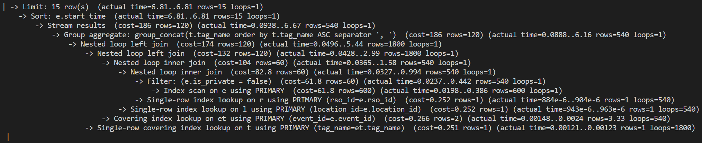
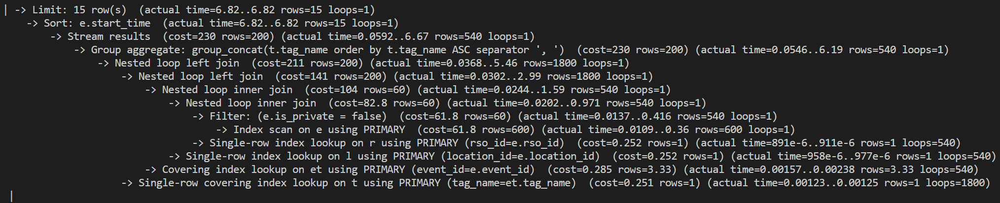
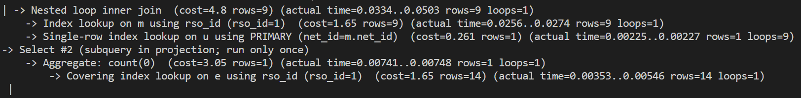
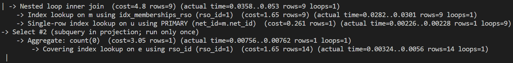
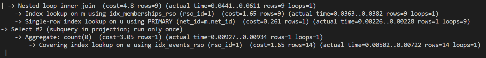
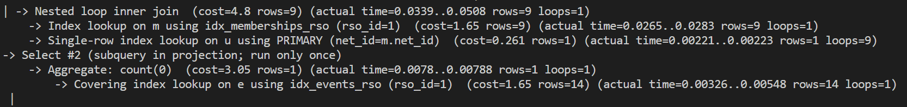
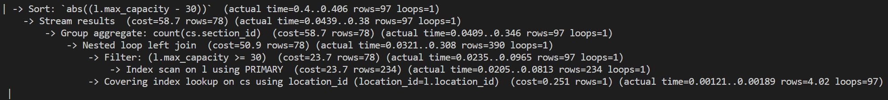
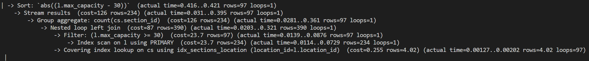
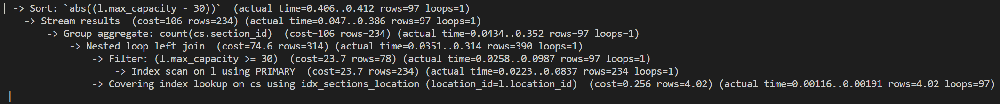

# CS 411 Stage 3: Indexing Analysis
**Project:** Virtually Integrated Agenda (VIA)
**Team:** Team001-TableForFour

---

## Overview

For each of the three advanced queries, we ran EXPLAIN ANALYZE before adding any indexes, then tested three additional indexing configurations and compared the cost reported by the optimizer.

---

## Query 1: Public Event Feed (getPublicEvents)

### Baseline (No Custom Indexes)

```sql
EXPLAIN ANALYZE ...;
```


**Baseline cost:** 186

### Config A: Index on `Events.start_time`

```sql
CREATE INDEX idx_events_start ON Events(start_time);
EXPLAIN ANALYZE ...;
```


**Cost:** 230 | **Change vs baseline:** +44

### Config B: Index on `Event_Tags.tag_name`

```sql
CREATE INDEX idx_event_tags_tag ON Event_Tags(tag_name);
EXPLAIN ANALYZE ...;
```


**Cost:** 230 | **Change vs baseline:** +44

### Config C: Composite index on `Events(start_time, is_private)`

```sql
CREATE INDEX idx_events_time_private ON Events(start_time, is_private);
EXPLAIN ANALYZE ...;
```


**Cost:** 230 | **Change vs baseline:** +44

### Selected Index Design

**Choice:** Baseline configuration

**Reasoning:** All three configs increased cost by the same amount (+44). Config A would only help if there were a date-range filter, but with NULL params the `NULL IS NULL` condition bypasses it. Config B cannot reduce the lower table size because the LEFT JOIN requires all events to appear regardless of matches. Config C's composite index on `(start_time, is_private)` has the same problem as Config A, filtering out 10% of rows is not worth the index overhead. Since the query must read nearly every event, aggregate with GROUP_CONCAT, and do multiple joins, a sequential scan is the best option.

---

## Query 2: RSO Detail with Event Count (getRsoById)

### Baseline (No Custom Indexes)

```sql
EXPLAIN ANALYZE ...;
```


**Baseline cost:** 4.8+3.05 = 7.85

### Config A: Index on `RSO_Memberships.rso_id`

```sql
CREATE INDEX idx_memberships_rso ON RSO_Memberships(rso_id);
EXPLAIN ANALYZE ...;
```


**Cost:** 4.8+3.05 = 7.85 | **Change vs baseline:** +0

### Config B: Index on `Events.rso_id`

```sql
CREATE INDEX idx_events_rso ON Events(rso_id);
EXPLAIN ANALYZE ...;
```


**Cost:** 4.8+3.05 = 7.85 | **Change vs baseline:** +0

### Config C: Composite index on `RSO_Memberships(rso_id, role)`

```sql
CREATE INDEX idx_memberships_rso_role ON RSO_Memberships(rso_id, role);
EXPLAIN ANALYZE ...;
```


**Cost:** 4.8+3.05 = 7.85 | **Change vs baseline:** +0

### Selected Index Design

**Choice:** No custom indexes. Baseline configuration retained.

**Reasoning:** The baseline cost of 7.85 is already very low, reflecting that this query touches a small number of rows by design. It fetches members of one specific RSO and runs a single scalar subquery. Config A targets the most likely bottleneck: the JOIN filtering by `rso_id`. Note that the `RSO_Memberships` primary key is `(net_id, rso_id)`, ordered by `net_id` first, so it does not efficiently serve a `rso_id`-only lookup. However, the table is small enough that a full scan is negligibly fast regardless, and cost was unchanged. Config B (`Events.rso_id`) targets the subquery's WHERE clause and would benefit most as the Events table grows. Config C's composite `(rso_id, role)` could serve as a covering index for the JOIN + SELECT, but again the dataset is too small for any difference to appear. If this query is run at scale with many RSOs and many more members, results may improve.

---

## Query 3: Venue Recommendation (getOccupiedDuring + getByCapacity)

### Baseline (No Custom Indexes)

```sql
EXPLAIN ANALYZE ...;
```


**Baseline cost:** 58.7

### Config A: Index on `Course_Sections.location_id`

```sql
CREATE INDEX idx_sections_location ON Course_Sections(location_id);
EXPLAIN ANALYZE ...;
```


**Cost:** 106 | **Change vs baseline:** +47.3

### Config B: Index on `Locations(max_capacity)`

```sql
CREATE INDEX idx_locations_capacity ON Locations(max_capacity);
EXPLAIN ANALYZE ...;
```


**Cost:** 126 | **Change vs baseline:** +67.3

### Config C: Index on `Events.location_id`

```sql
CREATE INDEX idx_events_location ON Events(location_id);
EXPLAIN ANALYZE ...;
```


**Cost:** 106 | **Change vs baseline:** +47.3

### Selected Index Design

**Choice:** No custom indexes. Baseline configuration retained.

**Reasoning:** All three indexes increased cost, though for different reasons. Config A targets the LEFT JOIN condition. With ~390 sections across 234 locations, there are fewer than 2 sections per location on average. At this density, a single sequential scan of the small Course_Sections table is faster than performing 234 individual index lookups. Config B targets the WHERE clause filter, but most rooms have capacity ≥ 30, meaning the index eliminates very few rows and the optimizer correctly prefers a full scan. Config C has no effect on this query because the Events table does not appear in the Query 3 SQL, this index was evaluated in anticipation of the full venue recommender which also filters out rooms occupied by active events. As Course_Sections grows to more rows with more semesters of data, Config A would likely become the right choice since the JOIN selectivity would improve.

---

## Summary

| Query | Baseline Cost | Best Config | Final Cost | % Improvement |
|-------|--------------|-------------|------------|---------------|
| Q1: Event Feed | 186 | Baseline (No Custom Indexes) | 186 | 0% |
| Q2: RSO Detail | 7.85 | Baseline (No Custom Indexes) | 7.85 | 0% |
| Q3: Venue Rec  | 58.7 | Baseline (No Custom Indexes) | 58.7 | 0% |
